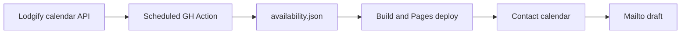

# Lodgify availability on a static contact form

Deferred 19 Aug 2026. Resume from this file; do not start until asked.

Stay with the owners’ manual Lodgify calendar and mailto enquiries. Availability is a **snapshot**, not a live booking check.

Decisions already made:

- Dates stay selectable. Warn when the stay looks booked; say so in the mailto body.
- With “nessuna preferenza”, a night is fully booked only when every house is occupied. After dates are chosen, note which houses still look free.

## Snapshot pipeline

- New script [`scripts/sync-lodgify-availability.mjs`](../../scripts/sync-lodgify-availability.mjs): `GET https://api.lodgify.com/v2/availability/{propertyId}?from=&to=` with `X-ApiKey` from `LODGIFY_API_KEY`. Horizon: today → +18 months. Do **not** request booking details; strip `bookings` / guest fields if they appear.
- Mapping lives in a committed, non-secret module (e.g. [`src/lib/data/lodgify.ts`](../../src/lib/data/lodgify.ts)): property id + `casa-1`…`casa-4` → `room_type_id`. First run of the script gets a `--list` mode (`GET /v2/properties` + rooms) so we can fill that map from curl results without putting the API key in the repo.
- Write a compact public file [`src/lib/data/availability.json`](../../src/lib/data/availability.json): `generatedAt`, date span, and per-house **occupied night ranges** only (`available === 0` or closed). Occupied = the night starting that date; check-out on a turnover day stays valid.
- If the API fails, **exit non-zero and keep the last good file**. If the JSON is unchanged, do not commit.

`GITHUB_TOKEN` commits do not retrigger [`ci.yml`](../../.github/workflows/ci.yml), so a new workflow (e.g. `.github/workflows/lodgify-availability.yml`) should: sync → commit if changed → `npm test` / `npm run build` / `npm run test:build` → upload + deploy Pages (same concurrency idea as CI so a code push and a calendar sync cannot clobber each other). Schedule: twice daily + `workflow_dispatch`. Secret: `LODGIFY_API_KEY` only.

## Contact form behaviour

Dates stay **selectable**. [`StayDates.svelte`](../../src/lib/standard/StayDates.svelte) / [`stay-dates.ts`](../../src/lib/standard/stay-dates.ts) gain occupied-night input:

- Style booked nights (house selected → that room; **nessuna preferenza** → only nights where **every** house is occupied). Not `disabled`.
- If the chosen `[checkIn, checkOut)` overlaps occupied nights, show a warning under the calendar (IT/EN in [`contactCopy`](../../src/lib/data/content.ts)).
- With dates chosen, house options can note which rooms still look free for that range.
- [`buildMailtoHref`](../../src/lib/standard/contact-mail.ts) adds a short calendar line: snapshot date + free/busy for the selected house (or which houses look free if no preference).
- Hint copy: this is indicative, updated a couple of times a day, not a confirmation.

No rates, quotes, or Lodgify booking API.

## Privacy and tests

- Privacy page: we publish **occupancy**, not guest names, from a Lodgify snapshot.
- Unit tests for range overlap, “all houses booked” vs per-house, mailto calendar line, and a fixture snapshot so tests never hit Lodgify.
- [`tests/assert-build.mjs`](../../tests/assert-build.mjs): prerendered contact HTML still has mailto; snapshot keys match the four house slugs.

## What you need to provide before implementation

- GitHub Actions secret `LODGIFY_API_KEY` (same key used with curl).
- Property / room type ids (or fill them from `--list` once). No key in git, ever.
