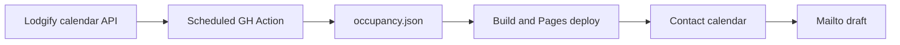

# Lodgify availability on a static contact form

Stay with the owners’ manual Lodgify calendar and mailto enquiries. Availability is a **snapshot**, not a live booking check.

Decisions already made:

- Occupied nights are disabled (grey). They cannot be selected or sent in the mailto.
- Checkout on the morning of an occupied night stays allowed (`[checkIn, checkOut)`).
- With “nessuna preferenza”, a night is blocked only when every house is occupied. After dates are chosen, houses that are occupied for that stay are disabled in the list.



## Snapshot pipeline

Auth: `GET https://api.lodgify.com/...` with header `X-ApiKey: $LODGIFY_API_KEY`. Same name for local curl and the GitHub Actions repository secret. No bookings, quotes, or rates APIs.

**Confirmed live (20 Aug 2026 probe):**

- One property, `start`/`end` HTTP 200.
- One availability call returns every room type (6: Casa #1–#5 + Tutte).
- 18-month window accepted in one request (`start=2026-08-20T00:00:00Z` … `end=2028-02-20T23:59:59Z`). Periods stay coalesced over that span (e.g. Casa #5 first occupied range ran `2026-08-20`–`2026-12-30`). No chunking.

| Site slug | Lodgify room | `room_type_id` |
| --- | --- | --- |
| `casa-1` | Casa #1 | `150204` |
| `casa-2` | Casa #2 | `150205` |
| `casa-3` | Casa #3 | `159913` |
| `casa-4` | Casa #4 | `159914` |

Property `129476` (“Antico Baglio Siciliano”). Ignore room types **Casa #5** (`150203`, not on the public site) and **Tutte** (`223104`, whole-baglio product; its calendar stayed `available: 1` for the whole sample month).

The house map is in [`src/lib/data/lodgify.ts`](../../src/lib/data/lodgify.ts) (filled from the live probe). `GET /v2/properties/{id}/rooms` is a large amenities dump; not needed for the map.

**Recurring occupancy pull:**

```
GET /v2/availability/129476?start={today}T00:00:00Z&end={+18 months}T23:59:59Z
```

Leave `includeDetails` off. Response is an array of `{ property_id, room_type_id, periods[] }`. Each period has `start`/`end` as `YYYY-MM-DD` (end **inclusive**), `available` 0/1, `closed_period`, and `bookings: [{ id, status }]` even without details — ids only, no guest names. Still strip `bookings`, `user_id`, and `channel_calendars` before writing public JSON.

Occupied = `available === 0` or a closed period. Occupied nights are every date from `start` through `end` inclusive. Sync also **fills a one-night hole** between two occupied ranges (unbookable under a 2+ night minimum stay). `[checkIn, checkOut)` still allows checkout on the morning of that filled night. Gaps of two or more free nights stay open. We do not call the rates API.

Mapping lives in a committed, non-secret module (e.g. [`src/lib/data/lodgify.ts`](../../src/lib/data/lodgify.ts)): property `129476` plus the four house rows above. Sync filters the six-room payload down to those four slugs.

The contact form reads the committed snapshot. Occupied nights are disabled. Snapshot script + scheduled workflow are in place.

- Write a compact public file [`src/lib/data/occupancy.json`](../../src/lib/data/occupancy.json): `generatedAt`, date span, and per-house **occupied night ranges** only.
- If the API fails, **exit non-zero and keep the last good file**. If the JSON is unchanged, do not commit.

`GITHUB_TOKEN` commits do not retrigger [`ci.yml`](../../.github/workflows/ci.yml), so a new workflow (e.g. `.github/workflows/lodgify-availability.yml`) should: sync → commit if changed → `npm test` / `npm run build` / `npm run test:build` → upload + deploy Pages (same concurrency idea as CI so a code push and a calendar sync cannot clobber each other). Schedule: twice daily + `workflow_dispatch`. Secret: **`LODGIFY_API_KEY`** only (`env: LODGIFY_API_KEY: ${{ secrets.LODGIFY_API_KEY }}`).

## Contact form behaviour

Occupied nights are **disabled**. [`StayDates.svelte`](../../src/lib/standard/StayDates.svelte) / [`stay-dates.ts`](../../src/lib/standard/stay-dates.ts) take occupied-night input:

- Grey out unavailable nights (house selected → that room; **nessuna preferenza** → only nights where **every** house is occupied). Not selectable.
- Checkout on the morning of an occupied night stays allowed. A stay that would include an occupied night cannot be chosen or mailed.
- With dates chosen, house options that are occupied for that range are disabled.
- With **nessuna preferenza** and dates chosen, the form hints which houses are free. Mailto has no occupancy line.

No rates, quotes, or Lodgify booking API.

## Privacy and tests

- Privacy page stays about visitor and enquiry data (mailto, analytics, hosting). Occupancy is not a visitor’s personal data.
- Unit tests for range overlap, disabled occupied nights, checkout-on-occupied-morning, “all houses booked” vs per-house, and a fixture snapshot so tests never hit Lodgify.
- [`tests/assert-build.mjs`](../../tests/assert-build.mjs): prerendered contact HTML still has mailto; snapshot keys match the four house slugs.

## What you need to provide before CI

- GitHub Actions repository secret **`LODGIFY_API_KEY`** (same name as local curl). No key in git, ever.
- Property / room type ids are known from the probe (table above).
